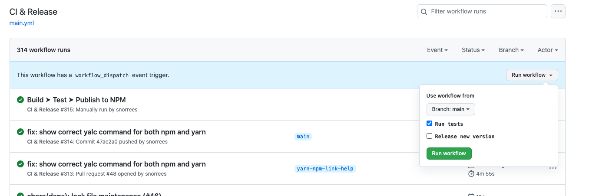

# Preset: semver-workflow

## Usage

### Inject into existing package
`npx @sanity/plugin-kit@latest inject --preset-only --preset semver-workflow`

### Use to init plugin
`npx @sanity/plugin-kit@latest init --preset semver-workflow <new-plugin-name>`

## What does it do?

Adds opinionated config and dependencies used by the Ecosystem team on Sanity, to develop using
semantic-release driven workflow on Github.



This preset:

- adds [husky](https://github.com/typicode/husky) for pre-commit hooks to ensure that:
  - all commits follow [conventional-commits](https://www.conventionalcommits.org/en/v1.0.0/#summary) format
  - all files in a commit pass eslint
- [semantic-release](https://semantic-release.gitbook.io/semantic-release/) automation for npm publish
  - automates Github releases 
  - updates package version based on conventional-commits
  - updates CHANGELOG.md
- [GitHub workflow](https://docs.github.com/en/actions/using-workflows) (Action) that 
  - does continuous integration 
  - has publish-on-demand support which delegates to semantic-release
- updates README.md with some standard texts, if missing

Keep in mind that this setup is tailored to the needs of the Ecosystem team at Sanity. 
Feel free to modify any and all files injected by the preset, or use it as a basis for creating your own workflow.

## Manual steps after inject

### 1. Install new dependencies

Run

```bash
npm install
```

### 2. Check README.md

The preset changes README.md in a naive manner.
Some text could be redundant or unnecessary depending on context and search for TODO.

Move text around until it looks good. Remember to change any v2 usage examples.

### 3. Check `.github/workflows/main.yml` branches

This differs from repo to repo, default is `[main]`

In a plugin repo with a v2 and v3 version, it could look like this:

```yml
# .github/workflows/main.yml
name: CI & Release
on:
  push:
    branches: [main, studio-v2]
```

### 4. Check secrets

Ensure that your repo or Github org has set the secrets used by the workflow.

`secrets.GITHUB_TOKEN` should always be available by default, but
`secrets.NPM_PUBLISH_TOKEN` is not.

Secrets can be set using `Settings -> Secrets -> Actions -> "New repository secret"`
on Github for a repository.

### 5. Check .releaserc.json

This differs from repo to repo. Branches defaults to `"branches": ["main"]`

In a typical plugin repo with a v2 and v3 version, it will typically look like this:

```json
{
  "extends": "@sanity/semantic-release-preset",
  "branches": ["main", {"name": "studio-v2", "channel": "studio-v2", "range": "1.x.x"}]
}
```

This assumes that the v2 version lives on `studio-v2` branch and the v3 version livs on `main`.
The v2 version will be constrained to a version range and use `studio-v2` as npm tag.
The v3 version will be release with `latest` npm tag.

### 6. Test workflow and remove `--dry-run`

The injected semantic-release command in `.github/workflows/main.yml` has `--dry-run` enabled.

Before removing the flag, perform a release on Github by manually triggering the `CI & Release`
workflow for the V3-branch and check "Release new version".

Inspect the workflow logs to see the version that will be used for the release.
If it is ok, remove the `--dry-run` flag from the workflow to perform a real release.

If the version is not what you expected, you might have to perform some
[troubleshooting](https://semantic-release.gitbook.io/semantic-release/support/troubleshooting).

#### Testing semantic-release locally

Create a github token with push access and set it in your shell as GH_TOKEN.

Now run:
`GH_TOKEN=$GH_TOKEN npx semantic-release --no-ci --dry-run --debug`

This will run semantic-release in dry-run mode (no git push or npm publish) and show everything that would
go into a release.

#### Note on "notable commits"
As configured, semantic-release will not consider commits starting with `docs:` or `chore:` as notable.
If you only have non-notable commits since the last release, semantic-release will not create a new version.

Therefore, chores or doc updates that should be considered notable should use `fix(chore):` or `fix(docs):` suffix instead.
